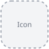

<div>
  <!-- Replace Resources/icon/placeholder.svg with the final icon when available. -->
  <h1>Waypoint </h1>
  <p>Coordinate navigation stacks, tabs, and presentations in your SwiftUI app while keeping view construction in the app.</p>
  <p>  </p>
</div>

## Routing examples

- **Open a sheet already at a detail.** Request Class 3 through Classes: the sheet
  opens at Class 3, and Back reveals the Classes list. [Watch the flow](https://github.com/Aeastr/Waypoint/releases/download/demo-recordings-2026-10-09/c02-open-class-through-parent.mp4).
- **Route into an open sheet.** Request another class and push it into the existing
  Classes stack, preserving its sheet identity. [Watch the flow](https://github.com/Aeastr/Waypoint/releases/download/demo-recordings-2026-10-09/c04-reuse-existing-context.mp4).
- **Present a sheet from a sheet.** Open a child Inspector from Class 3, then close
  it to return to the same class and navigation stack. [Watch the flow](https://github.com/Aeastr/Waypoint/releases/download/demo-recordings-2026-10-09/c05-nested-sheet.mp4).
- **Switch tabs and open a destination.** Select Library, then push a detail while
  Home keeps its own navigation history. [Watch the flow](https://github.com/Aeastr/Waypoint/releases/download/demo-recordings-2026-10-09/b02-switch-then-push.mp4).
- **Replace a sheet while inside its navigation stack.** Move from a class detail
  to Inspector, then return to the Classes list. [Watch the flow](https://github.com/Aeastr/Waypoint/releases/download/demo-recordings-2026-10-09/b07-replace-sheet-from-detail.mp4).
- **Open app windows and prominent editor scenes.** Route to a registered window
  or request a separate UIKit scene with prominent placement and a dedicated drag
  handle. [See window setup](Sources/Waypoint/Documentation.docc/Presentations/WindowRouting.md).

Browse [all 17 iPhone recordings](https://github.com/Aeastr/Waypoint/releases/tag/demo-recordings-2026-10-09),
or open the [HTML playback gallery](Resources/Recordings/index.html) locally for
a flow index and explanations beneath each video.

## Installation

In Xcode, choose **File → Add Package Dependencies**, enter
`https://github.com/Aeastr/Waypoint`, and add the **Waypoint** library product to
your app target. For a Swift package, add:

```swift
.package(url: "https://github.com/Aeastr/Waypoint.git", from: "0.1.0")
```

Then add `.product(name: "Waypoint", package: "Waypoint")` to the consuming
target's dependencies.

For local development, clone the repository and use the checkout directly.
In Xcode, choose **File → Add Package Dependencies → Add Local**, select the
Waypoint directory, and add the **Waypoint** library product to your app target.
For another local Swift package, add `.package(path: "../Waypoint")` to its
`dependencies` and `.product(name: "Waypoint", package: "Waypoint")` to the
consuming target's dependencies. Adjust the relative path to your checkout.

## Quick start

Own a router in the root view's state. Bind its path to a navigation stack and its
sheet route to `sheet(item:)`; buttons update that same router.

```swift
import SwiftUI
import Waypoint

enum Destination: Hashable {
    case detail
}

enum Presentation: String, PresentationRoute {
    case settings
    var id: String { rawValue }
}

@MainActor
struct RootView: View {
    @State private var router = Router<Destination, Presentation>()

    var body: some View {
        @Bindable var router = router

        NavigationStack(path: $router.path) {
            VStack {
                Button("Show detail") { router.navigate(to: .detail) }
                Button("Settings") { router.present(.settings) }
            }
            .navigationDestination(for: Destination.self) { destination in
                switch destination {
                case .detail: Text("Detail")
                }
            }
        }
        .sheet(item: $router.presentedSheet) { presentation in
            switch presentation {
            case .settings:
                Button("Close settings") { router.dismissSheet() }
            }
        }
    }
}
```

Use `RootView()` as the content of your app's main scene. Presentation routes use
sheets by default. For independent navigation stacks per tab, use `TabRouter`.

## Working with SettingsKit

Waypoint can coordinate app navigation with SettingsKit's programmatic settings
navigation. The app carries a `SettingsNavigationRequest` in its destination type,
selects the Settings tab through `TabRouter`, and passes the request to
`SettingsView`. SettingsKit resolves the requested groups within its own hierarchy;
Waypoint owns the app's tab selection and pending route.

This is app-level composition: add both packages to your app, with no dependency
between the packages. See the [SettingsKit integration guide](Sources/Waypoint/Documentation.docc/Navigation/SettingsKitIntegration.md)
for an example, including consuming requests and handling navigation failures.

## Presentation behavior and limits

A route can return `.window(id:)` from `presentationStyle` to request a scene
registered by your app with `WindowGroup(id:)`. Attach
`.routerWindowPresenter(request: $router.presentedWindow)` to forward new requests
to SwiftUI. Choose the style for each supported platform in your route definition.

Calling `present` replaces the current request and clears the other presentation
property. Clearing a sheet route dismisses its bound sheet; clearing a pending
window request does not close an already opened window. For `.window(id:)`, the
bridge forwards only the window ID and does not pass the route value to the new
scene. It consumes the pending request before dispatching it and observes
subsequent request changes, so
install it before requesting a window.

Waypoint exposes state synchronously on the main actor. Regular SwiftUI window
requests provide no activation error result. Prominent requests can report errors
through the presenter’s `onError` handler. Neither provides a visibility completion
callback. A cleared request establishes consumption, not that a window appeared.
Waypoint does not persist routes or restore navigation; the app owns those tasks.

For Mail-style detachable editors on iPad, routes can request
`.prominentWindow(activityType:)`. The window presenter requests a separate UIKit
scene with prominent placement and route-supplied user activity data. Add
`.routerWindowDragHandle()` to a dedicated grabber in that scene. Your app must
register and receive the activity and own the editor scene; see
[detachable window setup](Sources/Waypoint/Documentation.docc/Presentations/WindowRouting.md#open-a-detachable-sheet-like-scene-on-ipad).

## Testing app

Open [Demo/WaypointDemo.xcodeproj](Demo/WaypointDemo.xcodeproj) in Xcode and run
the **WaypointDemo** scheme on macOS or an iOS simulator. The app exercises both
routers, independent tab histories, path replacement, sheets, and platform-adaptive
window requests, with live router state. See the [demo guide](Demo/README.md) for
manual checks and build instructions.

Browse the [iPhone recordings folder](Resources/Recordings) or open the
[playback gallery](Resources/Recordings/index.html) to watch the 17 scripted
routing flows. Open the gallery locally; its videos are served as GitHub Release assets.

## Documentation

The [DocC catalog](Sources/Waypoint/Documentation.docc/Waypoint.md) contains guides
and navigation to the inline API reference:

- [Integrate with SwiftUI](Sources/Waypoint/Documentation.docc/GettingStarted/GettingStarted.md)
- [Manage stacks and tabs](Sources/Waypoint/Documentation.docc/Navigation/Navigation.md)
- [Present sheets and windows](Sources/Waypoint/Documentation.docc/Presentations/Presentations.md)

Open the package in Xcode and use **Product → Build Documentation** to browse the
catalog with generated symbol documentation.

## Contributing

See [CONTRIBUTING.md](CONTRIBUTING.md) for the project workflow, validation guidance,
and release conventions.

## License

Waypoint is available under the [MIT License](LICENSE).
